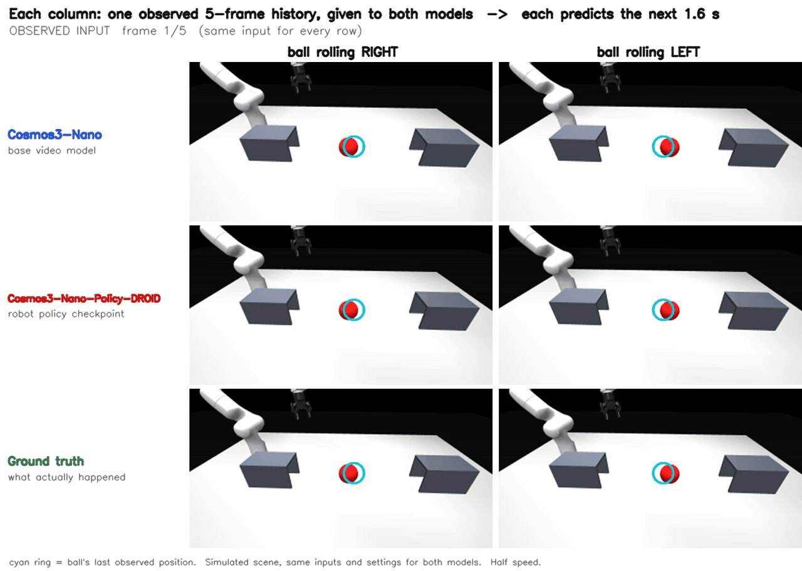

# Acting on moving objects with generative robot policies: a preliminary observation

*Jinda Jia, PhD student, CSE, UC San Diego (advisor: Dan Fu). Background in ML systems.*

## The problem
Large generative robot policies take a noticeable fraction of a second to produce actions. If the target object keeps moving during that time, the actions are computed from an observation that is already stale. A policy that understands how the object is moving could compensate for this; one that doesn't will aim at where the object *was*.

## A motivating experiment (simulation)
A red ball rolls across a tabletop at a constant speed. Two models receive the **same short observation history** (5 frames, about 0.27 s) and predict the next 1.6 s of video:
- **Cosmos3-Nano**, a general video world model;
- **Cosmos3-Nano-Policy-DROID**, the same model family fine-tuned as a robot policy on the DROID dataset.

Both models use identical input frames and the same sampling settings. We repeat this with the ball rolling **right** and rolling **left**.

*Each column is one observed history; rows are the two models and the ground truth. The cyan ring marks the ball's last observed position.*

## Preliminary observation
- **Base video model:** in these controlled examples, it continues the observed motion: the ball keeps rolling in the observed direction at a similar speed.
- **Policy checkpoint:** its predicted ball motion is much less sensitive to the input direction. Across 3 random seeds and 2 camera views, reversing the history direction changed the base model's predicted ball displacement by 74–88 px (ground truth ≈ 78 px), but the policy's by only −9 to +17 px.
- **Caveats:** this is a single simulated scene with a few seeds. The policy was fine-tuned on single-frame observations, so a multi-frame history is outside its usual setting. We read this as preliminary evidence, not a general conclusion about either model.

## The next question
**Can motion information help robot policies respond better to moving objects?** Simulation only goes so far, so I would like to test this on real hardware, starting with a simple, slowly moving object and a robot arm.

## Request
Your lab's work on robot learning and visual representations is closely related. I would be grateful for **access to a robot-arm setup in your lab** for a small initial experiment with a slowly moving object. If our interests overlap, I would also welcome the chance to collaborate.
# WAM-Research
